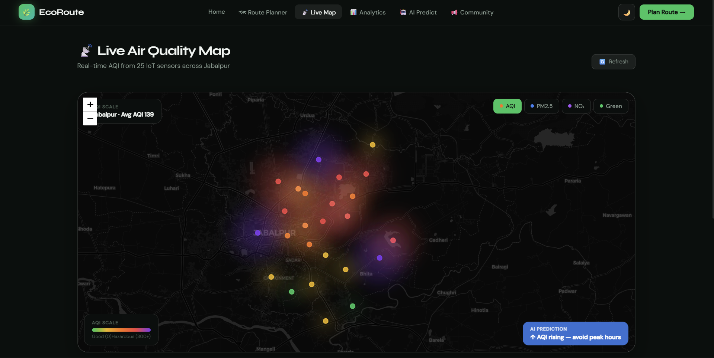
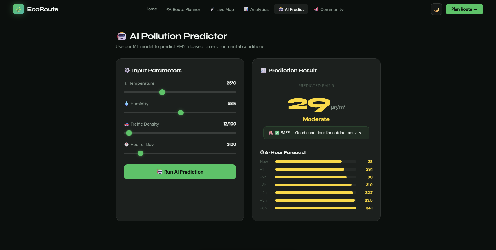
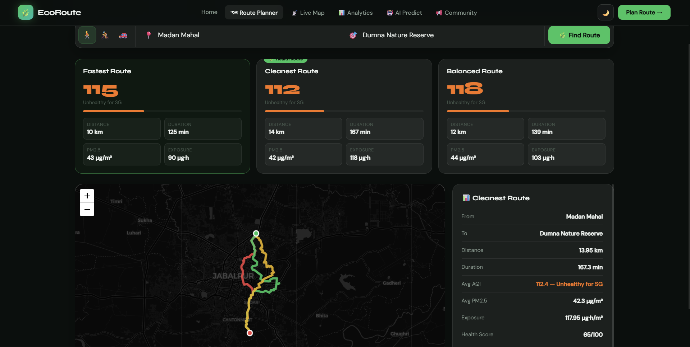
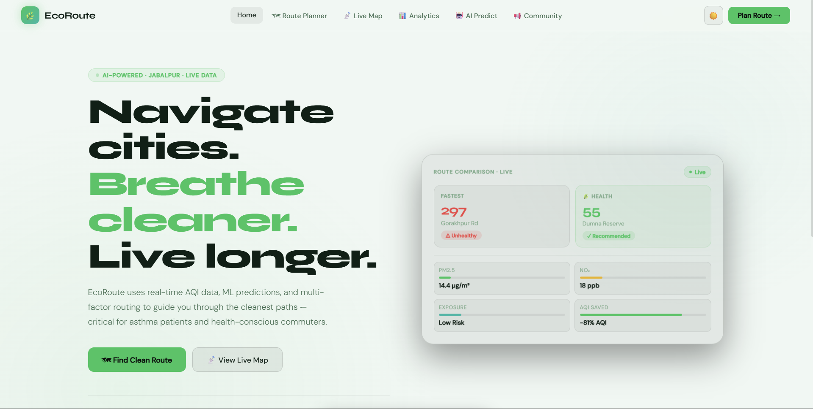
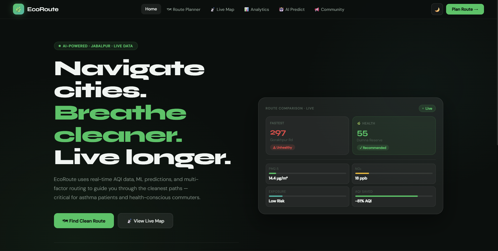

# 🌿 EcoRoute

**EcoRoute** is an intelligent route-planning platform that helps users choose the **cleanest and healthiest path** based on real-time air quality data.
Instead of only optimizing for time or distance, EcoRoute minimizes **pollution exposure** by analyzing AQI, PM2.5 levels, and predicted air quality conditions.

Built for **CodeKumbh Hackathon**.

---

# ✨ Features

### 🗺️ Smart Route Planning

EcoRoute calculates and compares three route options:

* **Fastest Route** – shortest travel time
* **Cleanest Route** – lowest pollution exposure
* **Balanced Route** – optimized between speed and air quality

---

### 🌫️ Live Air Quality Map

* Real-time AQI data from multiple IoT sensors
* Visual pollution clouds across the city
* Interactive map with AQI overlays

📸 *Map Preview*




---

### 🧠 AI Air Quality Prediction

EcoRoute uses AI to predict future air quality trends to help users plan routes smarter.

📸 *AI Prediction Dashboard*



---

### 📊 Pollution Exposure Analysis

For every route EcoRoute calculates:

* Average AQI
* PM2.5 concentration
* Total exposure during travel
* Health score

📸 *Route Comparison*



---

### 🌗 Light & Dark Mode

EcoRoute supports both **light mode and dark mode** for better usability and accessibility.

📸 *Light Mode*



📸 *Dark Mode*



---


# 🏗️ Tech Stack

**Frontend**

* React / Next.js
* Tailwind CSS
* Leaflet.js (Map Visualization)

**Backend**

* FastAPI
* Python

**Data & AI**

* AQI sensor data
* Pollution exposure modeling
* AI prediction system
* Ai Trained on Linear Regression

---

# 📂 Project Structure

```
EcoRoute
│
├── frontend
│   ├── components
│   ├── pages
│   └── styles
│
├── backend
│   ├── api
│   ├── models
│   └── services
│
├── public
│
├── images
│   ├── AiPollutionPredictor.png
│   ├── DarkMode.png
│   ├── LightMode.png
│   └── LiveAirQualityMapDark.png
│   └── RouteComparision.png
│
└── README.md
```

---

# 🚀 Installation

Clone the repository

```
git clone https://github.com/yourusername/ecoroute.git
cd ecoroute
```

Install dependencies

```
npm install
```

Run the development server

```
npm run dev
```

Start backend

```
uvicorn main:app --reload
```

---

# 📈 Future Improvements

* Wearable pollution sensor integration
* Personalized health recommendations
* Crowd-sourced pollution reporting
* Real-time traffic + AQI optimization

---

# 👥 Team

Built with dedication and love for **CodeKumbh Hackathon**.

Team: **CodeBlooded**

---

# 🏆 Vision

EcoRoute aims to make cities healthier by helping people **choose cleaner paths and reduce pollution exposure in daily travel**.

Small routing decisions can lead to **big health improvements** for millions of people.

---

⭐
