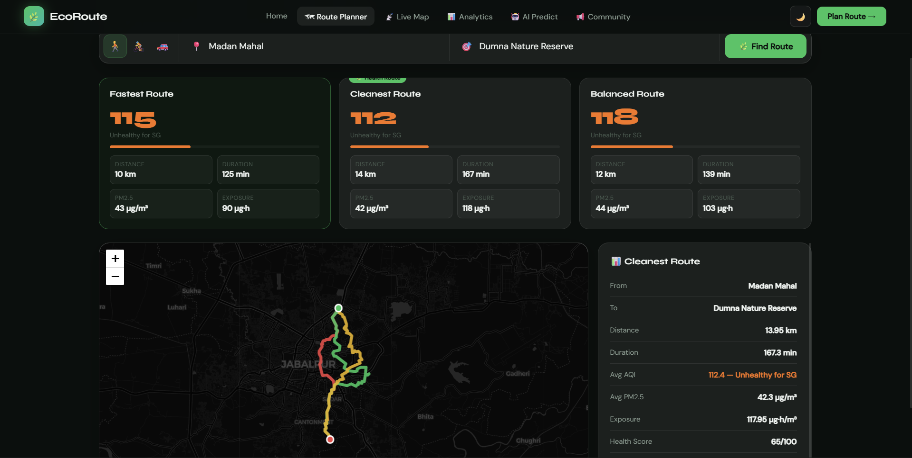
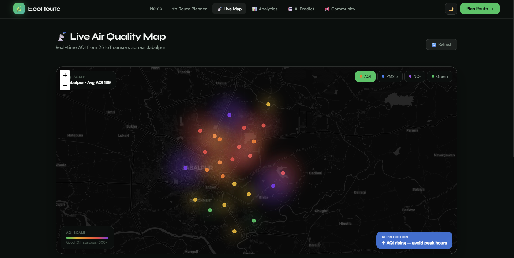
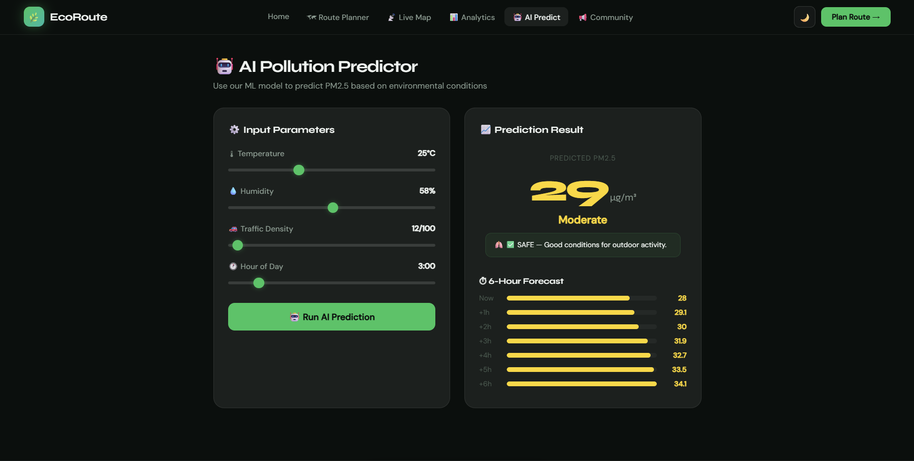
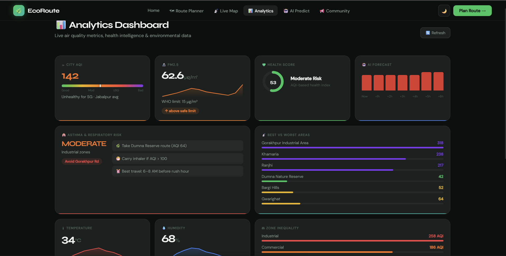
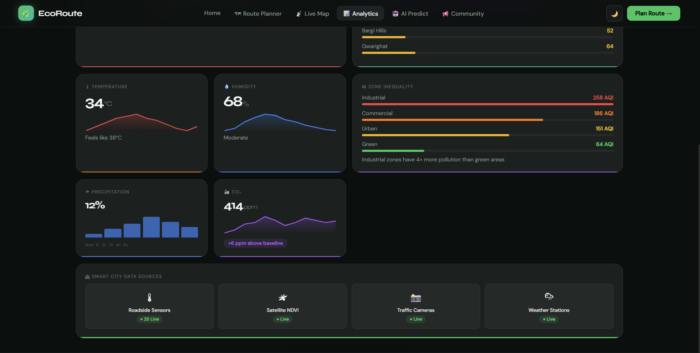
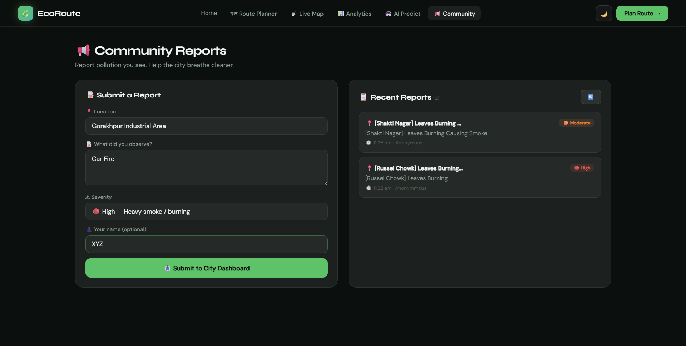
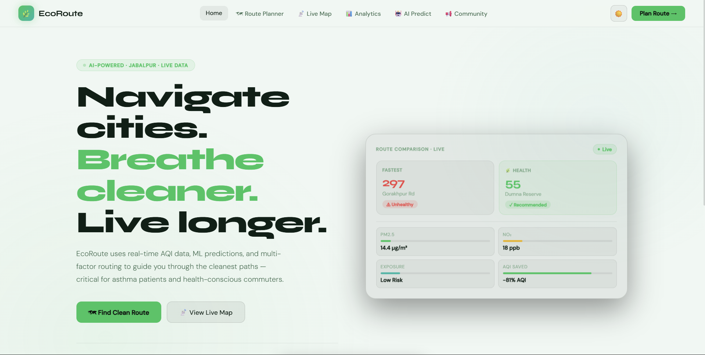
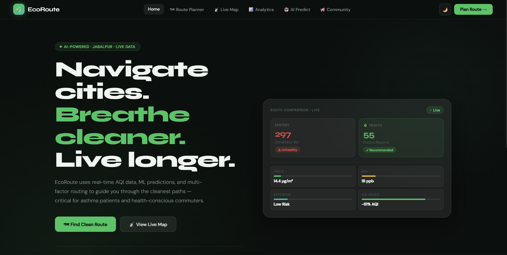

# 🌿 EcoRoute

**EcoRoute** is an intelligent route-planning platform that helps users choose the **cleanest and healthiest path** based on real-time air quality data.
Instead of only optimizing for time or distance, EcoRoute minimizes **pollution exposure** by analyzing AQI, PM2.5 levels, and predicted air quality conditions.

Built for **CodeKumbh Hackathon**.

---

# ✨ Features

### 🗺️ Smart Route Planning

EcoRoute calculates and compares three route options:

* **Fastest Route** – shortest travel time
* **Cleanest Route** – lowest pollution exposure
* **Balanced Route** – optimized between speed and air quality



---

### 🌫️ Live Air Quality Map

* Real-time AQI data from multiple IoT sensors
* Visual pollution clouds across the city
* Interactive map with AQI overlays

📸 *Map Preview*




---

### 🧠 AI Air Quality Prediction

EcoRoute uses AI to predict future air quality trends to help users plan routes smarter.

📸 *AI Prediction Dashboard*



---

### 📊 Pollution Exposure Analysis

For every route EcoRoute calculates:

* Average AQI
* PM2.5 concentration
* Total exposure during travel
* Health score

📸 *Pollution Analysis*




---
## 🧑‍🤝‍🧑 Community Pollution Reporting

EcoRoute enables users to **contribute real-time pollution reports** from their surroundings, helping improve the accuracy of the platform’s air quality data.

For every community submission EcoRoute records:

• Location of the report  
• Type of pollution (smoke, dust, waste burning, traffic congestion)  
• Description of the issue  
• Timestamp of the observation  

Community reports are visualized on the map to provide **additional environmental insights** and help other users avoid polluted areas.

📸 *Community Submission Interface*



---

### 🌗 Light & Dark Mode

EcoRoute supports both **light mode and dark mode** for better usability and accessibility.

📸 *Light Mode*



📸 *Dark Mode*



---


## 🏗️ Tech Stack

**Frontend**
- HTML5, CSS3, JavaScript (Vanilla)
- Leaflet.js (map visualization)

**Backend**
- Python 3.11
- FastAPI
- scikit-learn (ML pollution prediction)
- httpx (async API calls)

**APIs & Data**
- OpenRouteService API (routing)
- WAQI API (real-time air quality)
- Open-Meteo API (weather data)
- Simulated IoT sensor grid

**Deployment**
- Backend: Render
- Frontend: Vercel

---

# 📂 Project Structure

```
EcoRoute
│
├── frontend
│   ├── components
│   ├── pages
│   └── styles
│
├── backend
│   ├── api
│   ├── models
│   └── services
│
├── public
│
├── images
│   ├── AiPollutionPredictor.png
│   ├── DarkMode.png
│   ├── LightMode.png
│   └── LiveAirQualityMapDark.png
│   └── RouteComparision.png
│
└── README.md
```

## 🚀 Running Locally

**Backend**
```bash
cd Backend
pip install -r requirements.txt
uvicorn main:app --reload
```

**Frontend**

Just open `Frontend/index.html` in your browser, or use Live Server in VS Code.

---

# 📈 Future Improvements

* Wearable pollution sensor integration
* Personalized health recommendations
* Crowd-sourced pollution reporting
* Real-time traffic + AQI optimization

---

# 👥 Team

Built with dedication and love for **CodeKumbh Hackathon**.

Team: **CodeBlooded**

---

# 🏆 Vision

EcoRoute aims to make cities healthier by helping people **choose cleaner paths and reduce pollution exposure in daily travel**.

Small routing decisions can lead to **big health improvements** for millions of people.

---

⭐
